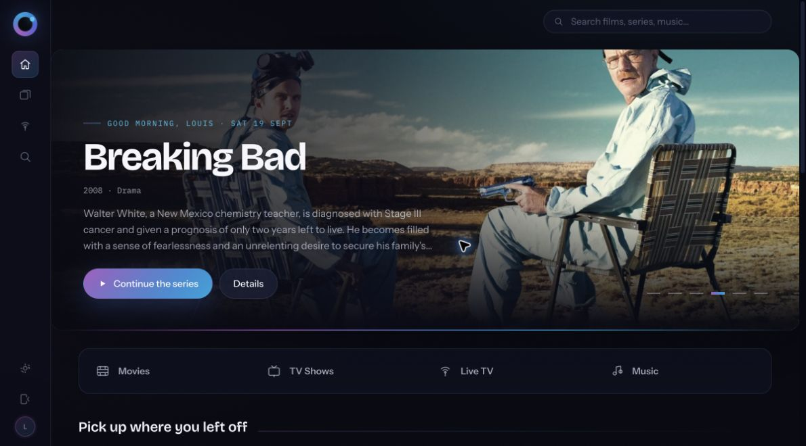
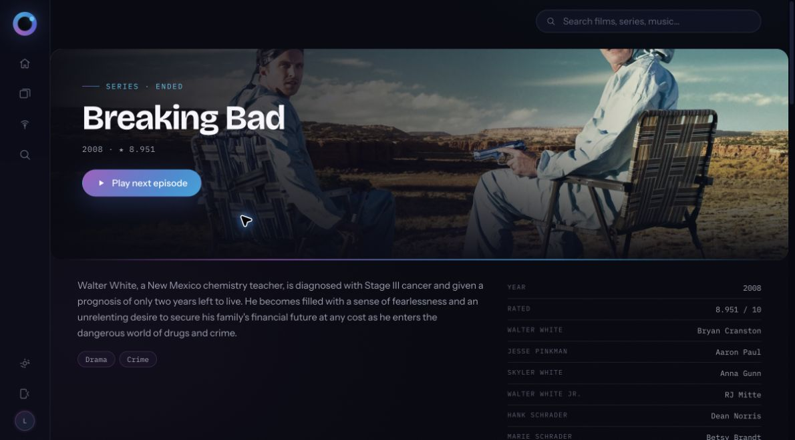
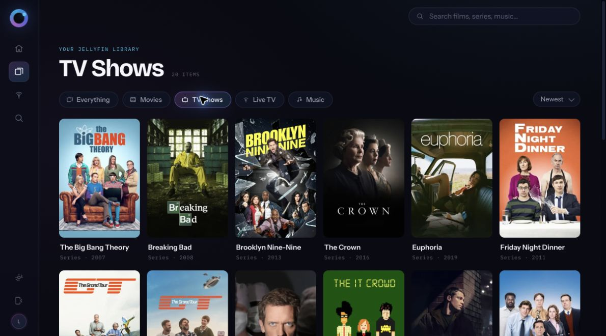
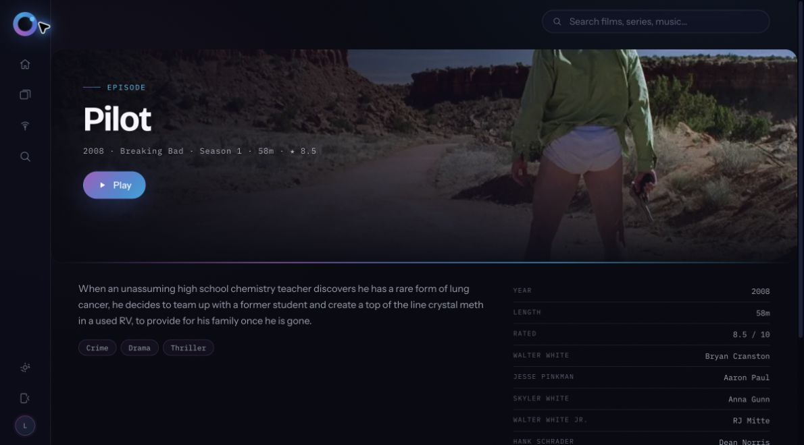

# Jellyflow

[](https://github.com/louisllw/Jellyflow/actions/workflows/ci.yml)
[](https://github.com/louisllw/Jellyflow/releases)
[](LICENSE)

A redesigned, flowing web client for [Jellyfin](https://jellyfin.org): dark, responsive and built to let your library do the talking.

> **Beta software:** Jellyflow is an independent community project. It is not affiliated with, maintained by, or endorsed by the Jellyfin project. Keep a standard Jellyfin client available while testing.

## Screenshots

| Home | Series details |
| --- | --- |
|  |  |

| TV library | Episode details |
| --- | --- |
|  |  |

## Run it

Jellyflow has no database. When a server is configured on the container, its nginx process proxies Jellyfin traffic so private Docker-network addresses work. Without one, the browser can connect directly to a public Jellyfin URL entered at sign-in.

```sh
docker run -d \
  --name jellyflow \
  -p 8080:8080 \
  -e JELLYFIN_URL=http://jellyfin:8096 \
  ghcr.io/louisllw/jellyflow:latest
```

Open <http://localhost:8080>. When set, `JELLYFIN_URL` pins the deployment to that server and proxies requests through Jellyflow, so a shared Docker-network hostname such as `http://jellyfin:8096` works. A public HTTPS URL may also be pinned. Omit the variable to let users enter a public server URL on the connect screen and connect directly from their browser.

Or use the included Compose file:

```sh
cp .env.example .env
docker compose up -d
```

Both `linux/amd64` and `linux/arm64` images are published, covering common servers and Apple Silicon Macs.

### Release channels

- `latest` is the current tested release and changes only when a GitHub release is published.
- `experimental` is rebuilt from the `experimental` branch for early testing and may be unstable.

To opt into experimental builds, replace the image tag in your Docker command or Compose file:

```sh
ghcr.io/louisllw/jellyflow:experimental
```

Each experimental build also gets an immutable `experimental-sha-<commit>` tag for rollback. Moving between channels requires an explicit image-tag change; experimental builds never update `latest`.

## Features

- Home shelves for continue watching, up next and new additions, with a rotating library hero.
- Full-library browsing, filtering, sorting, pagination and instant search.
- Movie and series details with redesigned seasons, episodes, cast and watch progress.
- Live TV guide, programme details, channel favourites, recording controls and recordings library.
- Responsive HLS player with resume, seek, volume, mobile controls, keyboard shortcuts and progress reporting.
- Installable PWA with a standalone app experience and privacy-safe shell caching.
- Runtime-configurable server connection, responsive navigation and reduced-motion support.

## Known beta limitations

- Playback currently needs broader capability-aware negotiation and codec coverage.
- Automatic next episode and a playback queue are not implemented.
- General favourites and manual watched/unwatched controls are incomplete.
- Music views, casting, SyncPlay and downloads are incomplete.
- User-entered servers connect directly from the browser and must allow Jellyflow through CORS. An HTTPS Jellyflow page also requires an HTTPS user-entered Jellyfin endpoint. Setting `JELLYFIN_URL` uses the same-origin proxy and avoids both restrictions.

See the [roadmap](ROADMAP.md) and [open issues](https://github.com/louisllw/Jellyflow/issues) for planned work.

## How authentication works

1. With `JELLYFIN_URL`, Jellyflow's nginx proxy forwards sign-in and media requests to the configured server. Without it, the browser sends them directly.
2. The password is discarded after sign-in.
3. Jellyfin's session token is stored in that browser's `localStorage` and is removed when you sign out.

The container does not store credentials or session data. Treat any device with an active session as signed in, use HTTPS outside a trusted local network, and never paste tokens into bug reports.

## Development

Node.js 22 is recommended.

```sh
npm ci
npm run dev
```

Build and check the project with:

```sh
npm audit --audit-level=high
npm run build
docker build -t jellyflow:test .
```

The production container runs nginx as an unprivileged user, validates runtime configuration and sends restrictive security headers. See [CONTRIBUTING.md](CONTRIBUTING.md) before submitting a change and [SECURITY.md](SECURITY.md) for private vulnerability reporting.

## Project transparency

Development has included substantial AI-assisted implementation and review. Maintainers remain responsible for accepting changes, running checks and documenting limitations; contributors are asked to disclose substantial AI-assisted changes for appropriate review.

## License

Jellyflow is available under the [MIT License](LICENSE).
